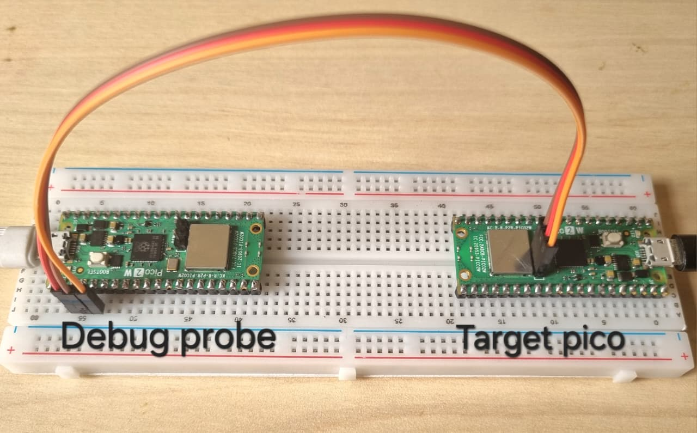

# Pico 2W Rust Debug Probe

This project shows how to build a **low-cost SWD debugging environment** using two **Raspberry Pi Pico 2W (RP2350)** boards. **Serial Wire Debug (SWD)** is the standard debugging interface used by ARM Cortex-M microcontrollers. Clone the repository to test the correct execution of the instructions and to ensure that the debug probe is working.

With SWD you can:

* flash firmware
* halt execution
* inspect memory
* set breakpoints
* capture logs (RTT / defmt)



In this setup:

* One **Pico 2W acts as the debug probe**
* One **Pico 2W acts as the target microcontroller**

The system uses **probe-rs**, a modern Rust-based debugging toolkit.

---

# Hardware Setup

Two Raspberry Pi Pico 2W boards are required.

One board will run the **debugprobe firmware**, while the second board will be the **target**.

Both boards must be powered through USB.

---

# Installing probe-rs

Install probe-rs tools:

```bash
curl -LsSf https://github.com/probe-rs/probe-rs/releases/latest/download/probe-rs-tools-installer.sh | sh
```

Verify installation:

```bash
probe-rs --version
```

---

# Flashing the Debug Probe Firmware

The debug probe Pico must be flashed with the firmware provided by Raspberry Pi.

Download from:

https://github.com/raspberrypi/debugprobe/releases

The required file is:

```
debugprobe_on_pico2.uf2
```

Steps:

1. Put the Pico into **BOOTSEL mode**
2. Connect it via USB
3. Drag the file **debugprobe_on_pico2.uf2** to the mounted USB drive (RP2350)

After flashing, reconnect the board.

---

# Wiring

Connect the debug probe to the target using SWD.

| Debug Probe | Target |
| ----------- | ------ |
| GP3         | SWDIO  |
| GP2         | SWCLK  |
| GND         | GND    |

Both boards must remain connected to the PC via USB.

---

# Verifying the Debug Probe

Check that the debug probe is detected:

```bash
lsusb
```

You should see something similar to:

```
Bus 001 Device 008: ID 2e8a:000c Raspberry Pi Debugprobe on Pico (CMSIS-DAP)
```

Verify communication with the target:

```bash
probe-rs info --chip RP2350
```

Expected output:

```
ARM Chip with debug port - Cortex-M33
```

If errors appear, they may be related to **USB permissions**.

---

# Building the Target Firmware

You must be inside the Rust project directory.

Example project structure:

```
blink-rust/
 ├─ Cargo.toml
 ├─ src/
 └─ target/
     └─ thumbv8m.main-none-eabihf/
         └─ debug/
             └─ blink-rust
```

Compile the firmware:

```bash
cargo build
```

This generates the ELF firmware at:

```
target/thumbv8m.main-none-eabihf/debug/blink-rust
```

---

# Flashing the Target Firmware

Program the firmware using probe-rs:

```bash
probe-rs download target/thumbv8m.main-none-eabihf/debug/blink-rust --chip RP235x
```

Expected terminal output:

```
Erasing ✔ 100%
Programming ✔ 100%
Finished in ~2s
```

Reset the microcontroller:

```bash
probe-rs reset --chip RP235x
```

---

# Quick Run Command

After building once, you can use:

```bash
probe-rs run target/thumbv8m.main-none-eabihf/debug/blink-rust --chip RP235x
```

This command will:

* program the firmware
* start execution

---

# Faster Workflow with cargo tools

Install probe-rs cargo tools:

```bash
cargo install probe-rs-tools
```

Flash directly with:

```bash
cargo flash --chip RP235x
```

This compiles and programs the firmware automatically.

Another powerful option is:

```bash
cargo embed
```

This opens a debugging terminal and allows log capture using RTT / defmt.
